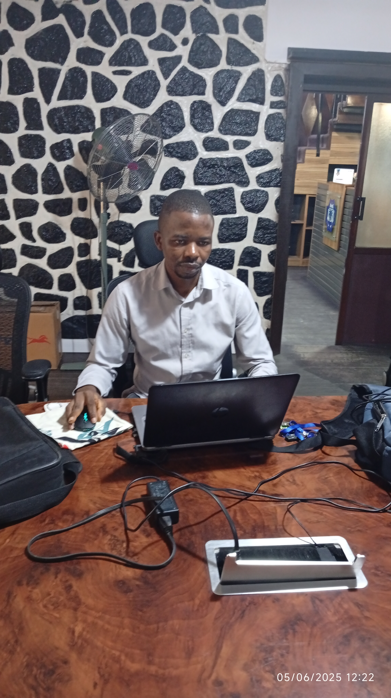

# Adding Your Profile Photo

## Quick Steps

1. **Prepare your photo:**
   - Use a square photo (1:1 aspect ratio works best)
   - Recommended size: 400x400 pixels or larger
   - Supported formats: JPG, PNG, or WEBP
   - File size: Keep under 500KB for fast loading

2. **Rename your photo:**
   - Rename your photo file to `profile.jpg` (or `profile.png`)
   - Make sure the name matches what's in `index.html` (currently set to `profile.jpg`)

3. **Add photo to your repository:**
   - Copy your photo to the `CharyMeld.github.io` folder
   - It should be in the same folder as `index.html`

4. **Commit and push:**
   ```bash
   git add profile.jpg
   git commit -m "Add profile photo"
   git push origin main
   ```

## Folder Structure

Your folder should look like this:
```
CharyMeld.github.io/
├── index.html
├── projects.html
├── contact.html
├── README.md
└── profile.jpg          ← Your photo here
```

## Using a Different Filename

If you want to use a different filename (like `charles.png`), update line 45 in `index.html`:

**Change from:**
```html

```

**Change to:**
```html

```

## Fallback

If the photo doesn't load or doesn't exist, the site will automatically show your initials "CI" in a beautiful gradient circle. So your site works perfectly even without a photo!

## Tips for Best Results

- Use a professional headshot or a clear photo of yourself
- Ensure good lighting and a clean background
- Crop the photo to focus on your face
- Use online tools like [Squoosh.app](https://squoosh.app) to optimize file size
- Consider using a photo editing tool to add a subtle background blur

## Testing Locally

Before pushing to GitHub, you can test locally:
1. Put your photo in the folder
2. Open `index.html` in your browser
3. Check if the photo displays correctly
4. If it looks good, commit and push!
